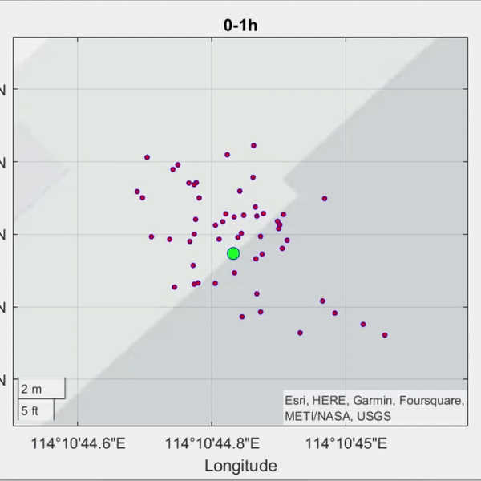

Hello! I am Jiarong, welcome to my homepage.

I am an undergraduate student at the Department of Aeronautical and Aviation Engineering, the Hong Kong Polytechnic University. I am currently doing undergraduate research supervised by [Dr Li-Ta HSU](https://www.polyu.edu.hk/aae/people/academic-staff/dr-hsu-li-ta/) and [Dr Guohao ZHANG](https://www.polyu.edu.hk/aae/people/academic-staff/dr-zhang-guohao/). My research interest is Navigation, Positioning, 3DMA GNSS, Sensor Fusion. I also wants to try some related areas like Autonomous Driving and Robotic inspired by [Dr Weisong WEN](https://www.polyu.edu.hk/aae/people/academic-staff/dr-wen-weisong/).

I am working on a project titled "Improving Urban GNSS Positioning by Realistic Measurement Simulation from Digital Twins", hope I can have a publication soon.

I am also working on a LLM Agent project with my friends.

Important Dates
======
11/20/2023: Jiarong's Homepage is set up.

Page Visitors Records
======
[]!(| width = 100)
